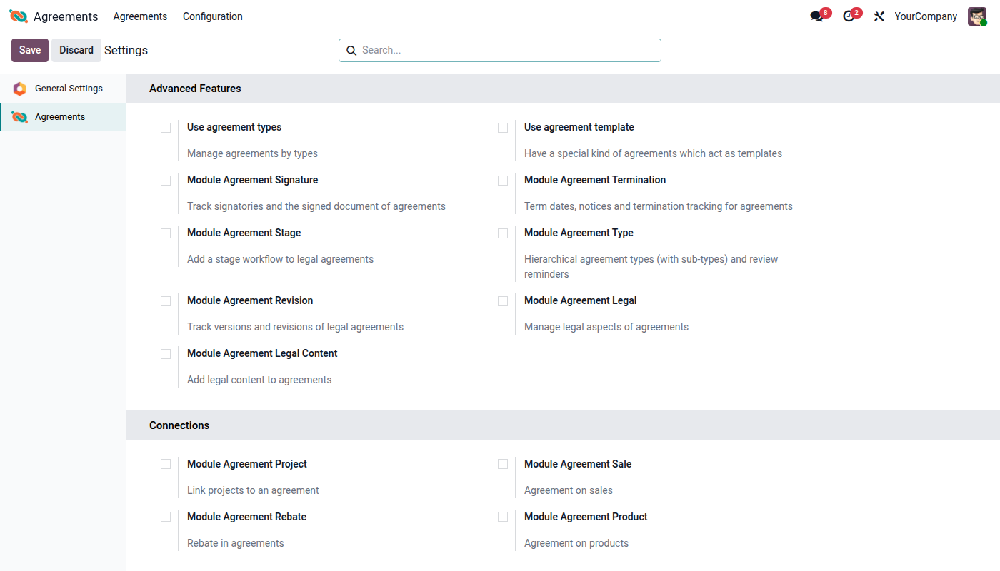

## Access rights

The module creates an *Agreement* privilege with three roles. Assign them in
*Settings \> Users & Companies \> Users*, tab *Access Rights*:

- *Read-Only Users*: see the *Agreements* menu and read agreements.
- *User*: create, edit, delete and archive agreements, and read agreement
  types. When the module is installed, every existing internal user
  receives this role.
- *Manager*: in addition, manage agreement types and the *Agreements*
  settings.

Agreement types and agreement templates are available to every user with
one of these roles.

## Settings

Go to *Agreements \> Configuration \> Settings* (Manager role required).

- *Advanced Features* offers shortcuts to the agreement types and agreement
  templates and lets you install the extension modules for signatures,
  termination, stages, hierarchical types, revisions and legal content.
- *Connections* lets you install the modules linking agreements to
  projects, sales, rebates and products.

## Agreement types

Go to *Agreements \> Configuration \> Types* (Manager role required) and
create the types you need. Each type has a name and a default domain
(*Sale* or *Purchase*) that is applied to agreements of that type. Types
can be archived.
