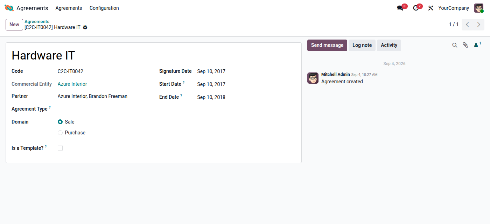
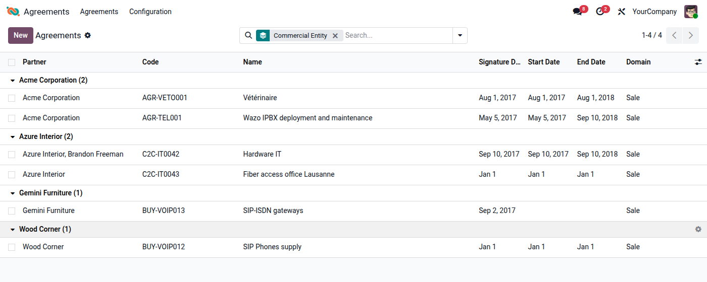
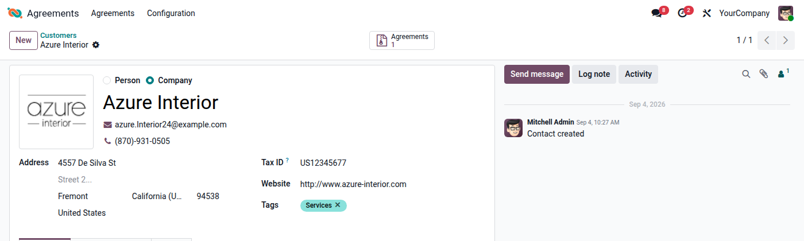

## Create an agreement

1. Go to *Agreements \> Agreements* and click *New*.
2. Enter the *Agreement Name* and the *Code*. The code must be unique per
   commercial entity and company. Agreements are displayed as
   `[code] name` everywhere.
3. Select the *Partner*. You can pick a contact person of a company: the
   company is then shown as *Commercial Entity* above the partner.
4. Choose the *Domain*: *Sale* for agreements with customers, *Purchase* for
   agreements with suppliers. If you select an *Agreement Type*, the domain
   of the type is applied; you can still change it.
5. Enter the *Signature Date*, *Start Date* and *End Date*.
6. In a multi-company setup, check the *Company* of the agreement.

Changes to the code, name, partner, domain and dates are tracked in the
chatter, where you can also log notes, send messages and schedule
activities.

## Find agreements

The agreement list can be searched by name or code and by partner. The
*Sale* and *Purchase* filters restrict the list to one domain, and the
*Archived* filter shows archived agreements. Group the list by partner,
commercial entity, signature date or domain. The *Commercial Entity* column
is optional and can be shown from the column selector.

On the partner form, the *Agreements* smart button shows the number of
agreements linked directly to that partner and opens them. A new agreement
created from there is pre-filled with the partner.

## Duplicate and archive agreements

- *Actions \> Duplicate* copies an agreement. As the code must be unique,
  the copy gets the code of the original followed by *(copy)*.
- *Actions \> Archive* hides an agreement without deleting it. Archived
  agreements are shown with the *Archived* filter and can be unarchived
  from there.

## Agreement templates

Templates are agreements used as a starting point for new agreements. They
do not require a partner and are not shown in the main agreement list.

1. Go to *Agreements \> Configuration \> Templates* and create a template,
   or tick *Is a Template?* on an existing agreement.
2. To create an agreement from a template, open the template and use
   *Actions \> Duplicate*. The copy is a regular agreement: the template
   flag is not copied. Rename it, set the code and the partner.
