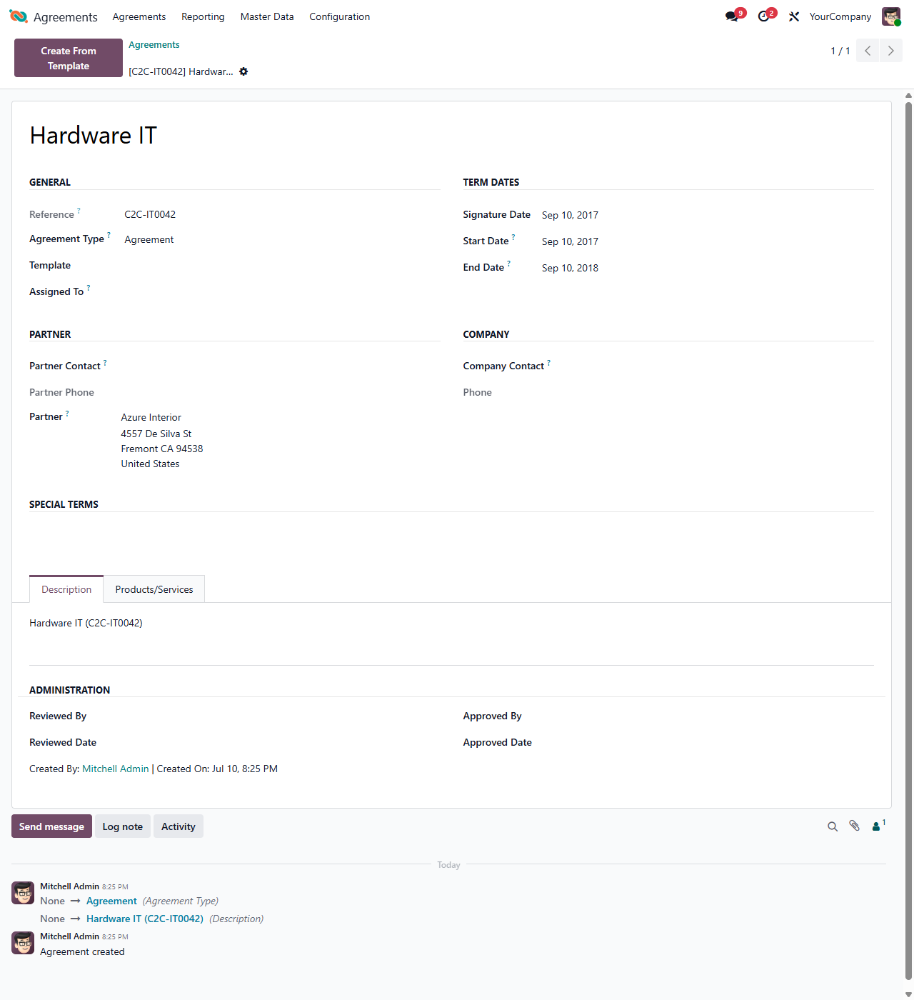

This module extends *Agreements Legal* to track a list of products and
services on an agreement.

It moves the *Products/Services* tab, its related *Products* menu and the
*Units of Measure* operations setting out of `agreement_legal`, so that the
core module no longer depends on `product`. Install this module only when you
need to link products or services to your agreements.

