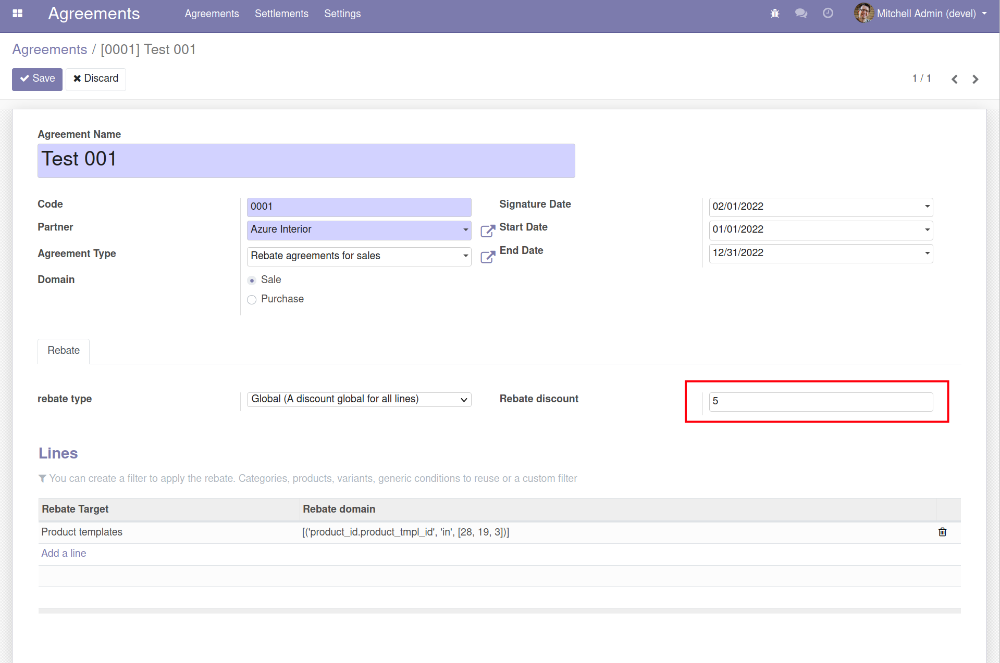
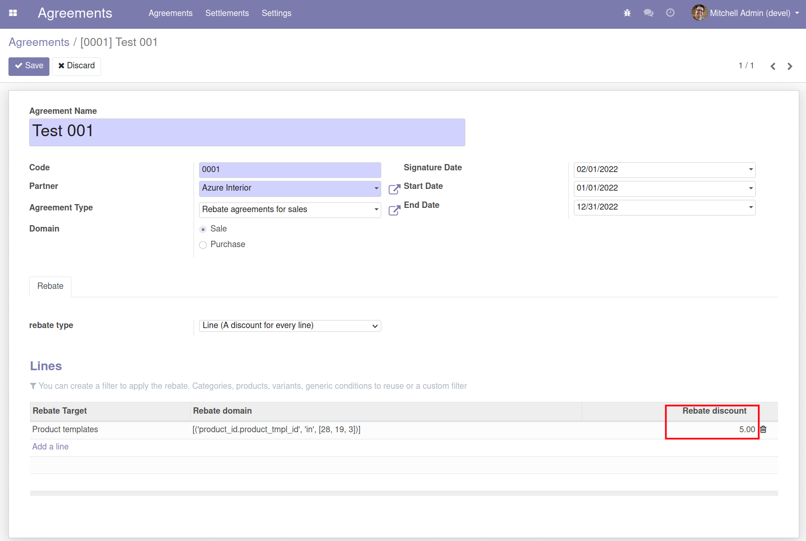
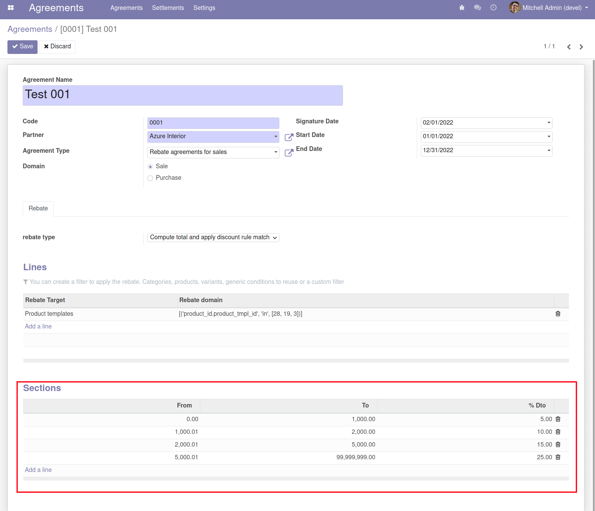
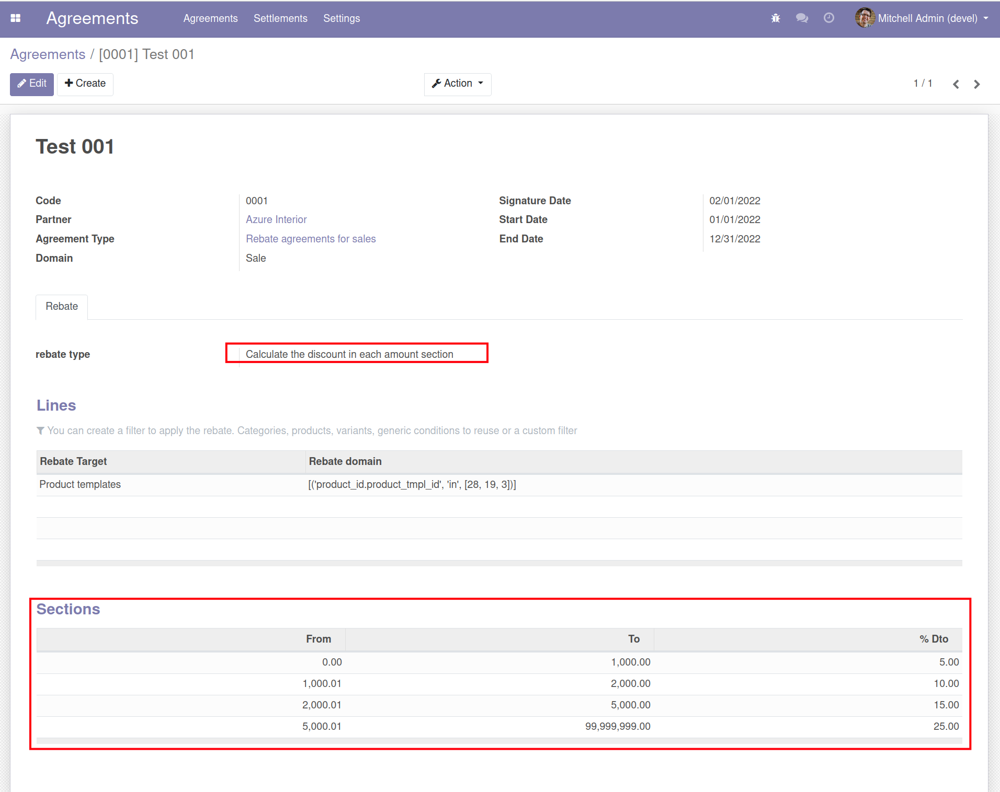
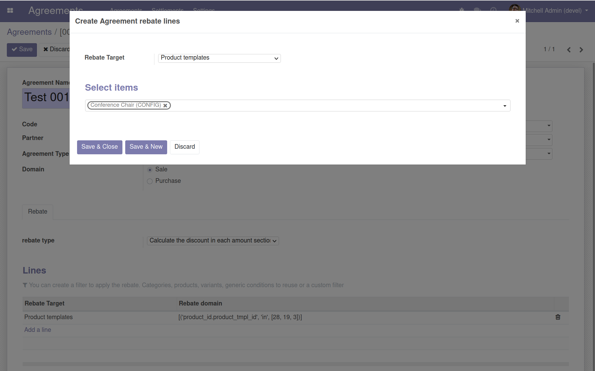
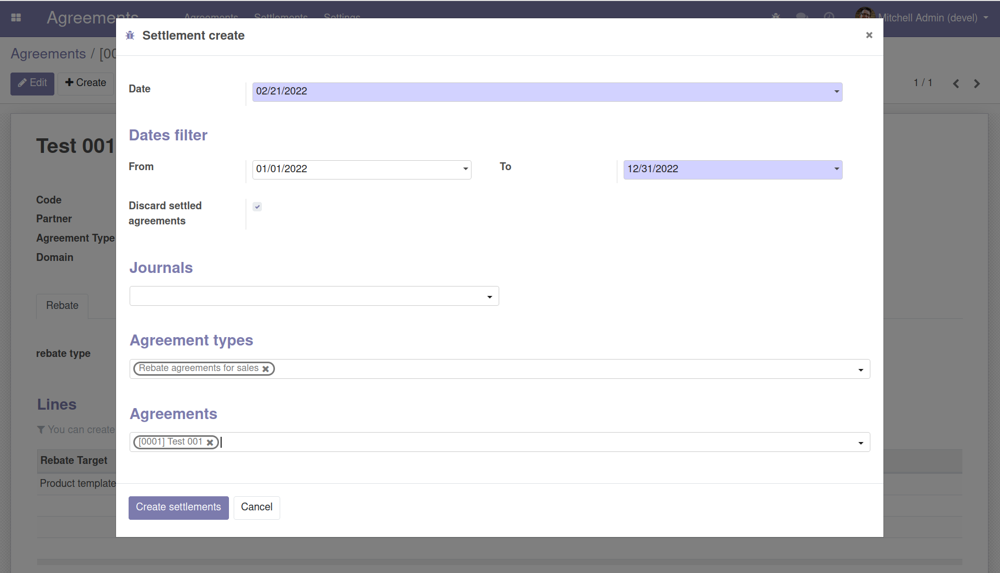
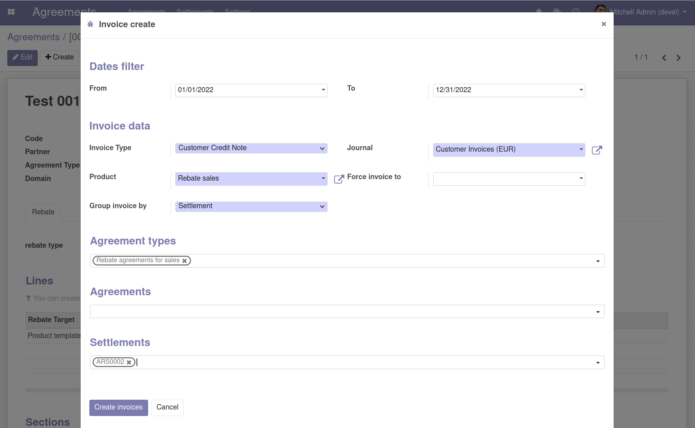

To use this module you need to:

1.  Go to a *Agreements \> agreement*.

2.  Create an agreement of type *Rebate agreement for sale*.

3.  Set a rappel type.

    > Basic global rappel discount
    >
    > 
    >
    > Basic rappel discount by line items
    >
    > 
    >
    > Section rappel discount rule match
    >
    > 
    >
    > Calculate the discount in each amount section
    >
    > 

4.  Create any rebate lines to apply this agreement.

    > Add a product template filter to apply this agreement
    >
    > 

5.  Do some invoices of products included in any rebate agreement

6.  Create rebate settlements from *Agreements \> Settlements \> Create
    Settlements* wizard

    > 

7.  Create rappel invoices from *Agreements \> Settlements \> Create
    Invoices* wizard

    > 
