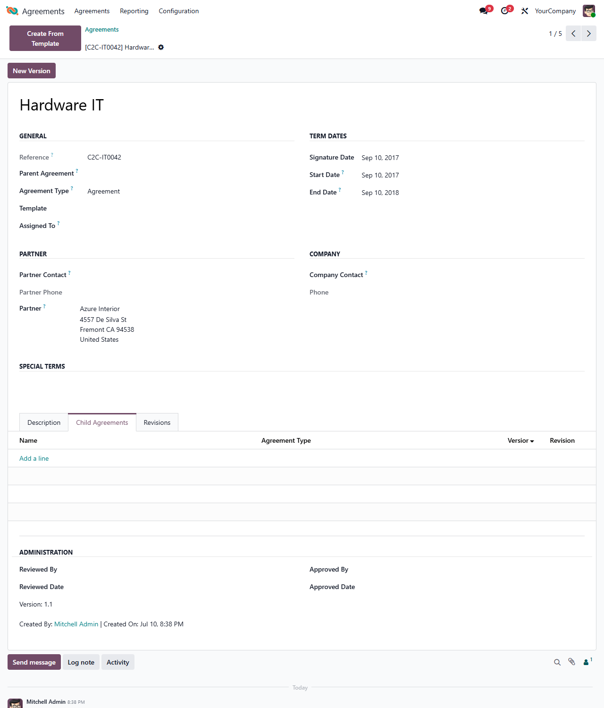

This module adds version and revision tracking to legal agreements.

It adds a `Parent Agreement` field on agreements (for example when an agreement
is an amendment to another one), the reverse `Child Agreements` list, and shows
the parent's creator/creation date in the form footer for child agreements.

It introduces a `version` and a `revision` field on agreements. The revision
increments automatically on every save, while the version is bumped through the
**New Version** button, which archives the current agreement as an *old version*
linked to its parent and resets the revision. Previous versions are listed under
a dedicated **Revisions** page on the agreement form.

