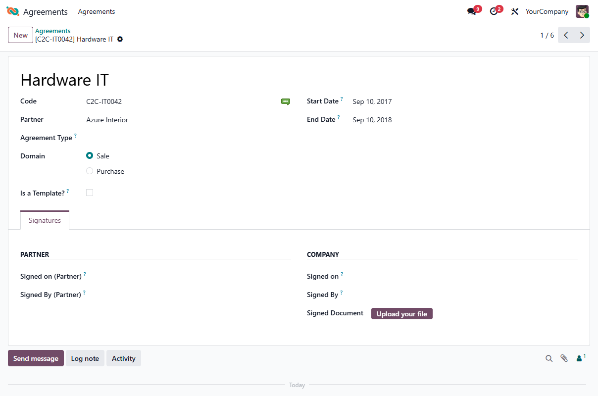

This module adds signature tracking to legal agreements.

It records who signed an agreement and when, on both the company and the partner
side, and lets you attach the resulting signed document. All of this is grouped
under a dedicated **Signatures** page on the agreement form.

