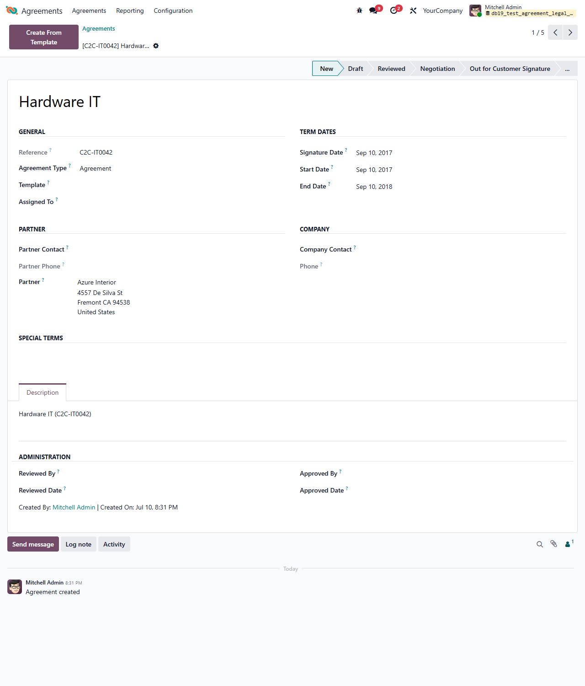

This module adds a configurable stage workflow to legal agreements.

It introduces the `agreement.stage` model, a `Stage` field on agreements with a
kanban grouped by stage, a statusbar on the agreement form, and a stage-driven
read-only lock that prevents editing an agreement once it reaches a stage
flagged as read-only.

