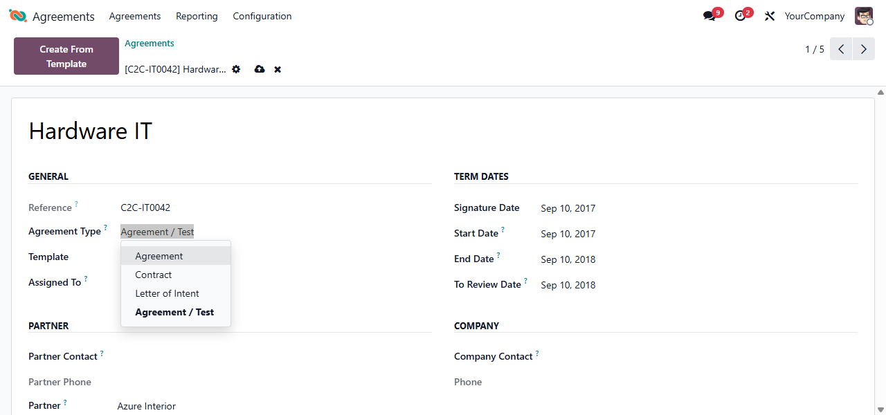

This module turns agreement types into a hierarchy: an agreement type can have
a parent type, so sub-types are simply child agreement types (the standalone
agreement.subtype model is no longer needed).

It also carries the review-reminder feature: the review user/days on the type,
the agreement's computed review date, and the cron that schedules a review
activity before an agreement expires.

